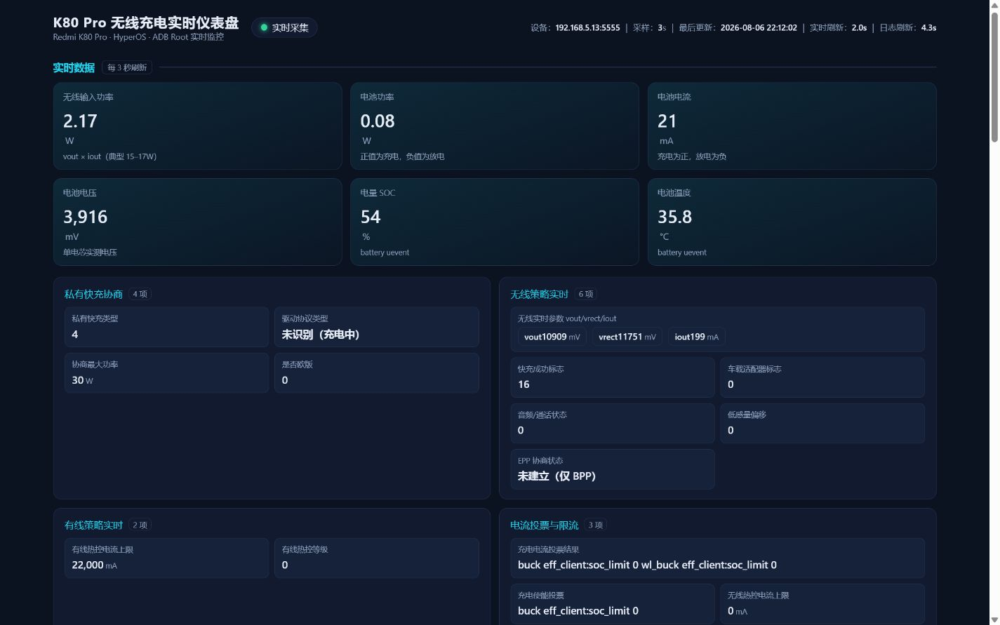
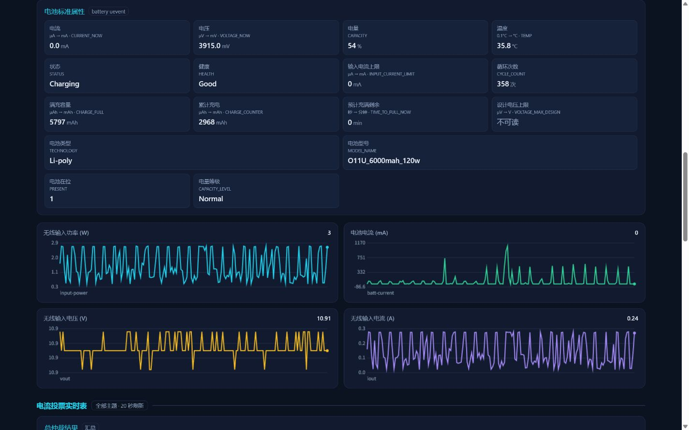
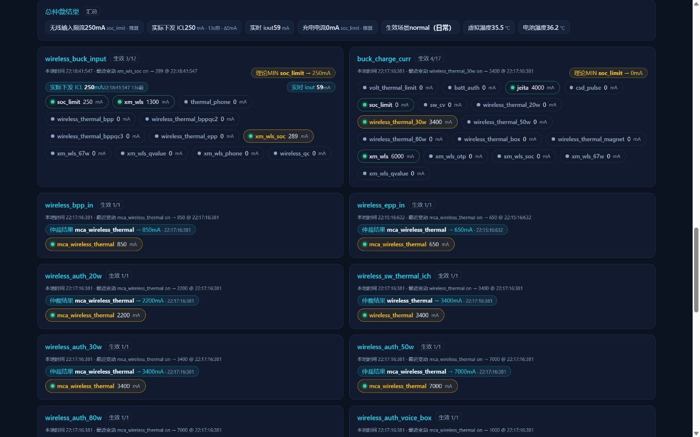
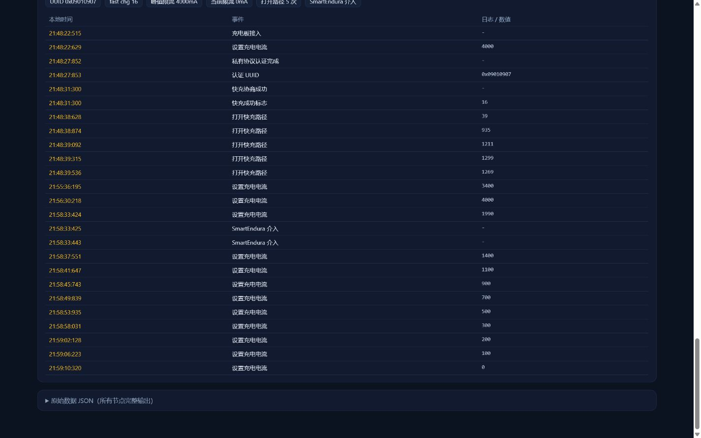
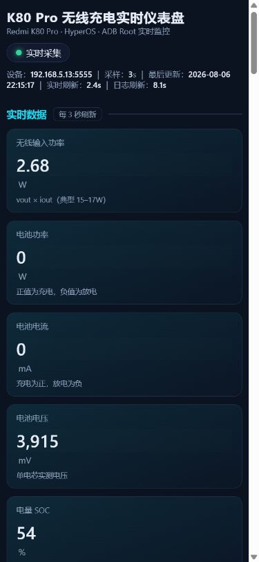

# K80 Pro 无线充电实时仪表盘（ADB 版）

单页仪表盘 + Python 标准库后端：通过 ADB root 读取 Redmi K80 Pro（miro）MCA 无线私有快充的所有充电实时数据，整合到一页展示。数据语义与安卓版 `SnapshotCollector.java` 完全对齐——本仓库是“安卓版仪表盘的 ADB 后端版本”，而不是另一套实现。

## 功能特性

- **双周期采集**：快速采集 3 秒（sysfs 节点、battery uevent、thermal.dump、历史曲线），日志采集 20 秒（投票表、会话、EPP、实际下发 ICL），避免每 3 秒重扫几 MB 日志
- **电流符号统一**：充电为正、放电为负，`Not charging` 也按放电处理；电池功率保留正负号；原始 JSON 仍保留内核原值方便排查
- **MCA 仲裁移植**：支持 `voting on/off`、完整 client 字符集、单位白名单（未知主题不默认 mA）、已反汇编核实的 `VOTE_POLICIES`（MIN / FIRST_NONZERO / FIRST_ZERO / UNKNOWN）、按主题缓存 `changed`/`result`
- **总仲裁只显示实际结果**：无线输入限流在仲裁值未生效（icl 与 iout 违反物理功率比）时，自动改用真正约束电流的限流（quick_wireless `cur_max:[Final]` / `buck_fcc`），ICL / iout 细节保留在投票详情卡
- **仲裁展示分离**：`effective vote is now`（MCA 逻辑仲裁）、`wireless loop icl`（驱动实际下发限流）、`wls_debug iout`（实时输出电流）三组独立展示，ICL 与 iout 偏差超过 200mA 时提示“可能为旧日志或不同控制阶段”
- **会话档案**：以 `power_good_on` 建立会话，`power_good_off` 记入“充电板移除”事件；保留全部电流变化与 open path 事件；最多 3 个会话、每个会话最多 100 条事件
- **日志容错**：日志读取失败保留上次成功数据并标记 `logs_stale`；读取成功但 grep 无匹配不算失败
- **ADB 自动重连**：每 5 秒节流重试 `adb connect` + `adb devices`，启动时未连接或中途掉线可自动恢复；指定 `--adb-host` 时优先使用该设备
- **断开清理**：无线断开（最后的电源事件为 `power_good_off`）时清除旧 ICL 与 EPP，避免上一会话残留
- **桌面端固定栅格**：1320px 居中，KPI 三列、实时数据两列、电池标准属性整行四列、曲线两列、总仲裁整行、会话单列；900px/560px 以下自动切换移动布局
- **meta schema_version=2**：`fast_interval`、`logs_interval`、`logs_updated_at`、`logs_stale`、`source`、`device` 等字段供页面双倒计时与刷新使用

## 界面预览

桌面端（1320px 固定栅格，KPI 三列、实时数据两列）：



电池标准属性（整行四列）、实时曲线与总仲裁结果：



电流仲裁实时表（总仲裁只显示实际结果；仲裁值未生效时自动改用真正约束电流的限流 quick_wireless cur_max / buck_fcc，ICL / iout 细节在投票卡内）：



实时会话档案：



手机端（移动布局，KPI 单列、卡片双列小格）：



## 运行

```powershell
python server.py
```

打开 <http://127.0.0.1:8765/>。

也可以直接双击 **`启动仪表盘.bat`**：它会自动进入本目录、启动服务并打开浏览器；出错时窗口会停留并显示错误信息。

**在其他电脑上使用（克隆仓库后）：**

1. 安装 Python 3（本项目只用标准库，无第三方依赖）
2. 安装/准备 adb：把 `adb.exe` 所在目录放到 `C:\adb`（脚本会自动探测），或加入 PATH；也可用 `--adb` 指定位置
3. 手机开启“无线调试”（开发者选项），并执行 `adb connect <手机IP>:5555` 连上设备
4. 双击 `启动仪表盘.bat`，或运行 `python server.py --open`

不写死设备地址：服务会**自动使用 `adb devices` 里已连接的设备**；有多台设备或需要指定时再用 `--adb-host`/`--serial`。

常用参数：

```powershell
python server.py --adb-host 192.168.33.118:5555 --port 8765 --interval 3 --logs-interval 20
启动仪表盘.bat 192.168.33.118:5555
```

- `--adb-host`：ADB over Wi-Fi 地址（默认空 = 自动识别已连接设备，且优先选择该设备）
- `--serial`：使用 `adb -s` 指定序列号
- `--adb`：adb 可执行文件或所在目录，默认自动探测 `C:\adb\adb.exe`，找不到再找 PATH
- `--interval`：快速采样/刷新间隔（sysfs、电池、热控、历史曲线），默认 `3` 秒
- `--logs-interval`：日志采集间隔（投票表、会话、EPP、实际下发 ICL），默认 `20` 秒
- `--port`：HTTP 端口，默认 `8765`
- `--open`：启动后自动打开浏览器

需要设备已 root（KernelSU 等），后端通过 `adb shell su -c "cat <节点>"` 读取 sysfs 节点。

## 数据语义（与安卓版一致）

### 电流与功率

| 电池状态 | `derived.batt_current_ma` | `derived.battery_power_w` |
| --- | --- | --- |
| Charging | 正值 | 正（充电功率） |
| Discharging | 负值 | 负（放电功率） |
| Not charging | 负值 | 负 |
| Full / Unknown | 保留内核原始值 | 跟随电流符号 |

- `derived.batt_current_ma`：µA → mA 并统一符号
- `derived.batt_voltage_mv`：µV → mV
- `battery.current_now` / `battery.voltage_now` 等原始 uevent 值**原样保留**，页面展示层负责换算；排查内核原始值直接看原始 JSON
- `real_type` 状态化：`Unknown` 在放电/未充电时显示“未连接（放电中）”，充电中显示“未识别（充电中）”，不当作采集失败
- 热控电流节点（`wired_chg_curr` / `wireless_chg_curr`）原始单位 µA，页面按 `ua_to_ma` 换算为 mA 并标注“策略上限”

### 投票仲裁

- `VOTE_UNITS`：只有已核实的电流主题才标注 `mA`，未知主题默认空单位
- `VOTE_POLICIES`：来自 miro 固件 .ko 反汇编核实的仲裁类型（MIN / FIRST_NONZERO / FIRST_ZERO / UNKNOWN）
- `changed`/`result` 按主题分别缓存，日志交错时不会串线；`voting off` 正确解析为 `enabled: false`
- MCA `effective vote is now` 是逻辑仲裁结果；`wireless loop icl` 是实际下发值；`wls_debug iout` 是实时测量值，三者互不覆盖

### 会话

- 以 `power_good_on` 建立新会话，并结束上一个未结束会话
- `power_good_off` 标记会话结束并写入“充电板移除”事件，之后的事件不再追加到已结束会话
- 保留全部 `set chg current` / `open path ibus` 事件；峰值/当前限流取最后 3 个会话内的最大/最新值

## API

`GET /api/data` 返回完整快照，顶层结构：

```json
{
  "ts": 1786023004333,
  "iso": "2026-08-06 21:54:36",
  "mode": "live",
  "connected": true,
  "nodes": [],
  "battery": {},
  "derived": {},
  "history": [],
  "voters": {},
  "sessions": [],
  "thermal": {},
  "meta": {
    "schema_version": 2,
    "interval": 3,
    "fast_interval": 3,
    "logs_interval": 20,
    "logs_updated_at": 1786023004333,
    "logs_stale": false,
    "adb": "192.168.5.13:5555",
    "source": "adb",
    "device": "192.168.5.13:5555"
  }
}
```

`GET /` 返回单页仪表盘（index.html）。

## 设备连不上时

**不显示任何伪造数据。** 页面会显示“设备离线”横幅和具体错误（如 `adb executable not found in PATH`、无设备在线），所有实时数值保持占位符；ADB 恢复后页面自动恢复实时采集（后端每 5 秒自动重试连接）。

## 常见问题

- **改了代码但页面没变化**：`server.py` 在启动时把 `index.html` 读入内存，修改后需要**重启服务**才会生效
- **页面打不开 / 数值一直回跳**：确认只有一个 `server.py` 实例在监听 8765 端口（不要重复双击 `启动仪表盘.bat`，Windows 下多个实例会互相抢端口）
- **页面显示“服务连接失败”**：确认访问的是 <http://127.0.0.1:8765/>，而不是直接双击打开 `index.html`（file:// 协议下无法请求 `/api/data`）
- **日志显示“读取失败”但设备正常**：只有 ADB/su/文件读取失败才标记 `logs_stale`；grep 无匹配（日志中暂时没有投票/会话内容）不算失败

## 文件

- `server.py`：Python 标准库实现，批量读取 MCA 实时节点 + battery uevent；双线程分别执行快速采集与日志采集，提供 `/`（页面）与 `/api/data`（JSON，含最近 180 个采样点的历史曲线数据）
- `index.html`：单页仪表盘（实时数据按 `fast_interval` 轮询 `/api/data`，投票/会话按 `logs_interval` 展示，桌面端固定栅格布局）
- `启动仪表盘.bat`：一键启动脚本（进入目录、带默认 ADB 地址启动、打开浏览器、出错停留）
- `无线充电热控数据库.md`：K80 Pro 无线充电热控完整数据库（温度→等级→电流/功率、全部充电场景、虚拟温度公式），数据来自设备树与解密后的热控配置

## 数据来源

`K80Pro_小米无线私有充电协议深度分析.md`（2026-08-03 实测）；实时投票表来自设备滚动日志 `/data/vendor/bsplog/charge/charge_logger/mca_log/`（投票变化时打印完整 VOTER 表，SoC 步进期间约每 10 秒一次），页面每 20 秒更新一次并按最新一张表展示。
