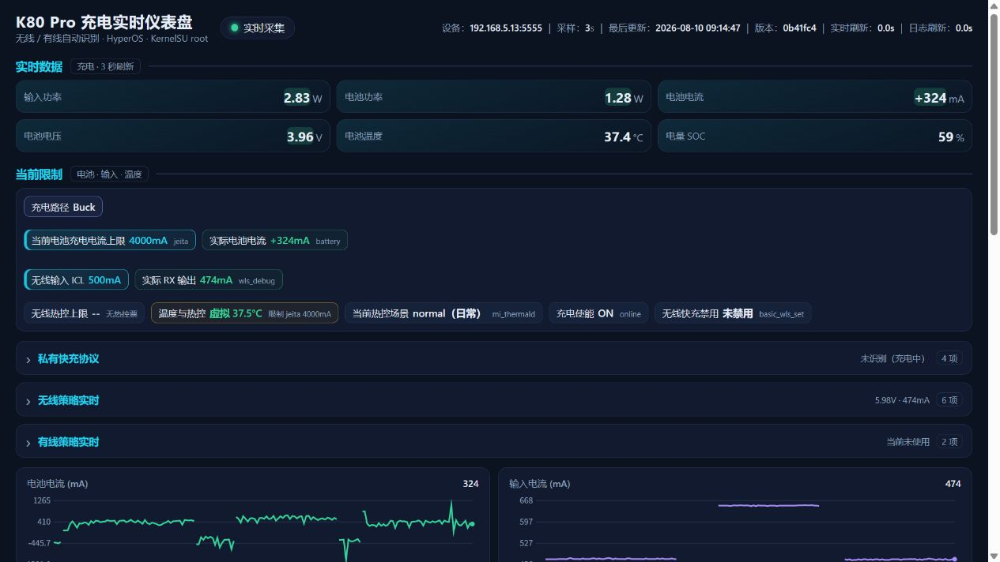

# K80 Pro 充电实时仪表盘（Web / ADB 版）

通过 ADB root 读取 Redmi K80 Pro（miro）的 sysfs、MCA 充电日志和 mi_thermald 状态，在本机浏览器集中展示无线/有线充电实时数据。后端仅使用 Python 标准库，不上传数据，也不会伪造离线数据。

Android 独立版见 [charging-live-dashboard-android](https://github.com/leowood2000/charging-live-dashboard-android)。两版的数据语义保持一致。

## v0.11.11 重点改进

### 更低的手机唤醒与后台功耗

- 快速采集自适应：正在充电时 3 秒，页面打开但未充电时 12 秒，超过 30 秒没有页面访问时 45 秒。
- 日志采集分级：连接/充电时 10 秒，完全断开时 60 秒，不再每 3 秒扫描 MCA 日志。
- session/event 最多扫描最近两个轮转文件，只解析并保留最新一个会话；功率路径使用最新一个文件的 1 MiB 窗口。
- 日志白名单使用 Android toybox 兼容的 `grep -F -e`，并在手机端 `tail` 限流，减少传输量和正则 CPU 开销。
- ADB 断线后每 5 秒节流重连；日志读取失败时保留上次成功结果并明确标记 stale。

> Android App 前台与 Web 页面同时显示时，两套采集器会分别执行 root/sysfs/日志读取，CPU 唤醒会叠加。实机 20 秒短测中，Android 单独前台约 13.97% 总忙碌率，同时开启 Web 活跃采集约 14.91%（仅作方向性参考）。做功耗测试时只保留一个前台界面：看 Web 时把 Android App 置于后台；看 Android 时关闭 Web 页面或停止服务。

### 更紧凑、可快速扫读的界面

- 桌面端实时数据为三列；四条曲线固定为：电池电流、输入电流、输入电压、输入功率。
- “当前限制”按固定层级排版：充电路径独占一行；电池充电上限与实际电池电流一行；无线输入 ICL 与实际 RX 输出一行；温度、场景和使能状态从下一行开始。
- 电池上限尚未捕获时保留 `-- / 待捕获`，不会因缺数据导致行结构塌掉。
- 私有快充、无线策略、有线策略和实时会话档案默认折叠。
- 电流投票默认只展示生效票；未生效票收进主题内折叠区。桌面端投票卡使用独立双列，避免一张高卡把另一列撑出大块空白。

### 已校正的数据语义

- 实时数据中的“电池温度”是电芯实体温度；“当前限制”中的绿色“虚拟温度”是 mi_thermald 的主要温控决策温度，并与当前热控场景放在一起。
- 无线连接期间优先读取实时 `mca_platform_cp/ibus_total`：实机验证 `≤20mA` 判定为 Buck、`≥100mA` 判定为 CP、`>20mA 且 <100mA` 显示“切换中”；避免把电荷泵预启动的 3–5mA 误判为当前 CP 主路径。无线未连接或节点缺失时才回退当前会话日志。
- 输入仍连接但已自动停充时，路径从“停止中”稳定收敛到“已停止”，当前上限不再回显旧 CP/Buck 目标；有线连接必须由实时 USB 在线或有效 VBUS 证明，拔线后不会被缓存日志重新判成有线。
- 日志年龄采用事件真实时间，并正确处理单个日志文件跨午夜；重启采集器不会把旧决策误标成“刚刚”。
- 当前电池充电电流上限按路径取值：CP 使用 Quick Wireless `cur_max:[Final]`；Buck 使用 `buck_charge_curr effective`；路径不确定时显示“待确认”，不拿 Buck FCC 冒充结果。
- 无线输入 ICL 取 `wireless_buck_input effective`，属于上游平台策略；实际 RX 输出取 `wls_debug iout`，属于遥测。二者并排观察，但不做数值一致性判断。
- `wireless_qc=100` 不是“最终输入限流为 100mA”，不能作为最终无线输入 ICL；该值不参与首页最终限制结论。
- `xm_wls` 是能力/适配器允许值，不等同当前仲裁 winner。
- `rx_iout_limit` 是驱动策略层的 RX 允许上限，和实际 RX 输出、上游 ICL 是三个不同层级。

## 界面预览



## 运行

要求：Python 3、ADB、已连接并取得 root 权限的手机。

```powershell
python server.py --open
```

也可以双击 `启动仪表盘.bat`。脚本会停止占用 8765 端口的旧 `server.py`，再启动当前版本并打开浏览器。

默认地址：<http://127.0.0.1:8765/>

常用参数：

```powershell
python server.py --adb-host 192.168.5.13:5555 --port 8765 --interval 3 --idle-interval 12 --no-viewer-interval 45 --no-viewer-after 30 --logs-interval 10 --open
```

| 参数 | 默认值 | 说明 |
| --- | ---: | --- |
| `--adb-host` | 自动选择 | ADB over Wi-Fi 地址；多设备时建议指定 |
| `--serial` | 空 | 传给 `adb -s` 的设备序列号 |
| `--adb` | 自动探测 | adb 可执行文件或目录 |
| `--interval` | 3 | 充电时快速采集间隔（秒） |
| `--idle-interval` | 12 | 页面有人访问、但未充电时的间隔（秒） |
| `--no-viewer-interval` | 45 | 长时间无页面访问时的间隔（秒） |
| `--no-viewer-after` | 30 | 进入无访问后台模式前的等待时间（秒） |
| `--logs-interval` | 10 | 连接/充电时日志采集间隔；完全断开自动变为 60 秒 |
| `--port` | 8765 | 本机 HTTP 端口 |
| `--open` | 关闭 | 启动后打开浏览器 |

未指定设备时，服务会从 `adb devices` 自动选择已连接设备。页面显示“设备离线”时，所有实时数值保持占位符，不会生成模拟数据。

## 主要数据来源

- `/sys/devices/platform/soc/soc:mca_*`：充电框架 sysfs
- `/sys/class/power_supply/battery/uevent`：电池状态、实体温度、电流和电压
- `/data/vendor/bsplog/charge/charge_logger/mca_log/`：MCA 投票、会话和功率路径日志
- `/data/vendor/thermal/thermal.dump`：虚拟温度、场景和热控等级

## API

- `GET /`：单页仪表盘
- `GET /api/data`：当前完整快照，包括 `battery`、`derived`、`history`、`voters`、`sessions`、`thermal` 和 `meta`

`meta.fast_interval` 与 `meta.fast_mode` 表示当前快速采集模式；`meta.logs_interval`、`logs_updated_at` 和 `logs_stale` 用于区分实时数据与低频日志数据的新鲜度。

## 架构与文件

- `server.py`：ADB/root 采集、解析、缓存、自适应调度和本机 HTTP 服务
- `index.html`：无框架单页仪表盘
- `启动仪表盘.bat`：Windows 一键启动
- `无线充电热控数据库.md` / `有线充电热控数据库.md`：设备热控资料
- `MAINTENANCE_NOTES.md`：跨会话维护总结、已确认语义、踩坑记录和发布检查表

## 排查

- 页面没变化：`index.html` 每次请求实时读取；修改 `server.py` 后必须重启服务。
- 页面一直回跳：检查是否有多个旧 `server.py` 同时监听 8765，或直接使用启动脚本。
- 页面显示服务连接失败：必须通过 `http://127.0.0.1:8765/` 访问，不能直接双击 `index.html`。
- 日志暂无匹配不等于读取失败；只有 ADB、su 或文件读取失败才设置 `logs_stale`。
